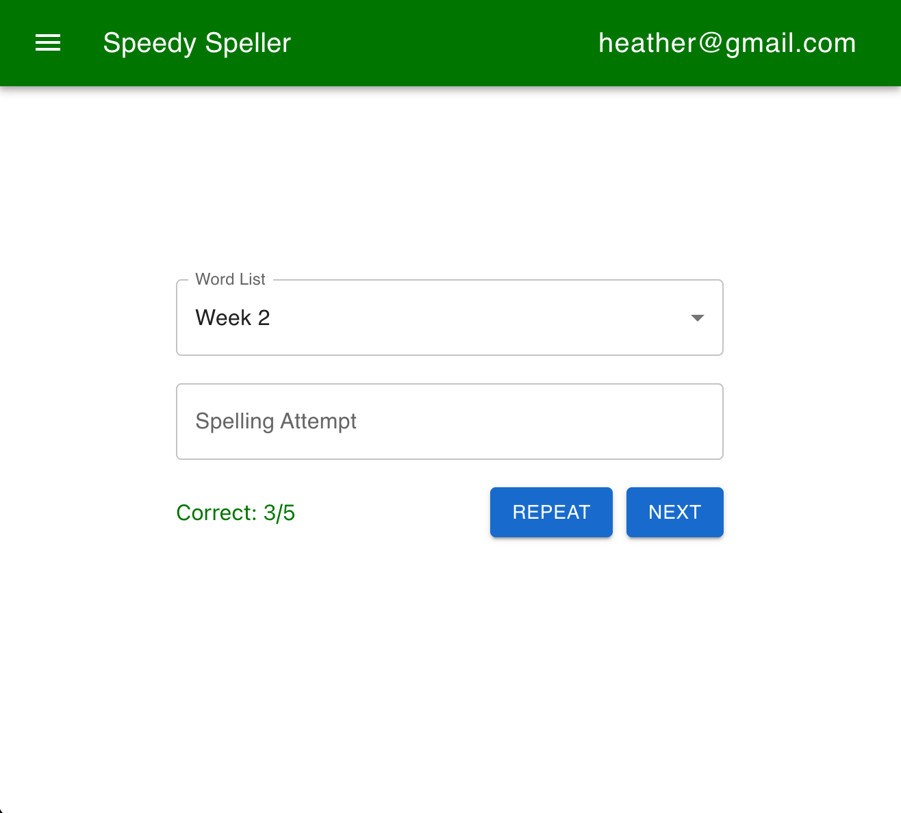
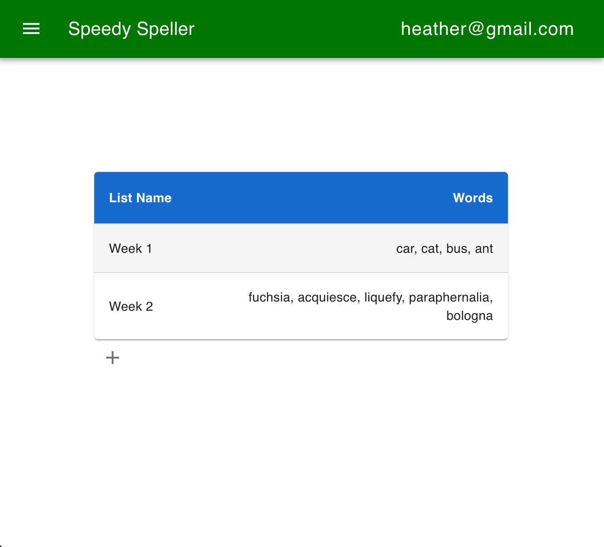
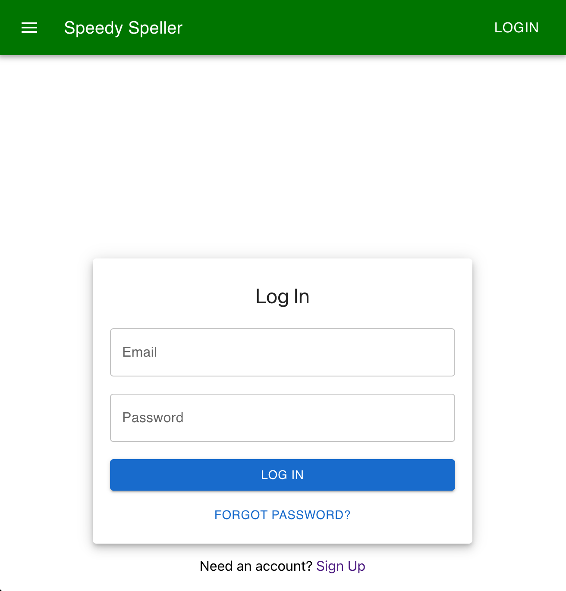

# Speedy Speller



## Table of Contents

- [Introduction](#introduction)
- [Features](#features)
- [Demo](#demo)
- [Getting Started](#getting-started)
  - [Prerequisites](#prerequisites)
  - [Installation](#installation)
- [Usage](#usage)
- [Screenshots](#screenshots)
- [Technologies Used](#technologies-used)
- [Contributing](#contributing)
- [License](#license)

## Introduction

Speedy Speller is a web application that allows you to create, update, and edit lists of words that you can use to practice your spelling skills. It provides valuable statistics at the end of your practice sessions, showing you how you performed.

## Features

- **Create Word Lists**: Easily create custom word lists for your spelling practice.
- **Update and Edit Lists**: Edit and update your word lists as needed.
- **Practice Mode**: Practice your spelling by going through your word lists.
- **Performance Statistics**: Get detailed statistics on your spelling practice, including correctness, incorrect attempts, and more.
- **User Authentication**: Securely sign in and use the app, ensuring your data is private.

## Demo

[Link to live demo](https://speedy-speller.firebaseapp.com/)

## Getting Started

### Prerequisites

Before you begin, ensure you have met the following requirements:

- Node.js and npm installed on your machine.
- A Firebase project set up for authentication and data storage. [Firebase](https://firebase.google.com/)

### Installation

1.  Clone the repository:

    ```sh

    git clone https://github.com/atarihomestar/speedy-speller.git

    ```

2.  Install dependencies:

    ```sh

    cd speedy-speller
    npm install

    ```

3.  Create a Firebase project and configure the Firebase credentials in your app.
4.  Run the development server:

    ```sh

    npm start

    ```

5.  Open your web browser and visit `http://localhost:3000`.

## Usage

1.  Sign in or create an account.
2.  Create a new word list or select an existing one.
3.  Start your spelling practice.
4.  View your performance statistics after completing your practice.

## Screenshots

 

## Technologies Used

- React
- Firebase (Authentication and Realtime Database)
- Material-UI
- SpeechSynthesis API

## Contributing

Contributions are welcome! If you'd like to contribute to this project, please follow these steps:

1.  Fork the project.
2.  Create your feature branch: `git checkout -b feature/your-feature`.
3.  Commit your changes: `git commit -m 'Add some feature'`.
4.  Push to the branch: `git push origin feature/your-feature`.
5.  Submit a pull request.

## License

This project is licensed under the [MIT License](https://chat.openai.com/c/LICENSE).
